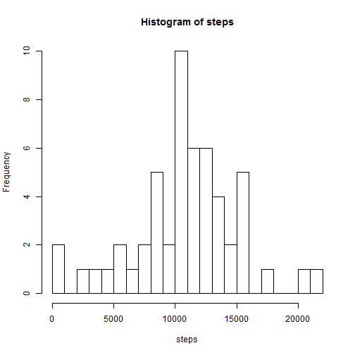

## Coursera Reproducible Research Project 1

#Loading and preprocessing the data


```r
Sys.setlocale("LC_TIME", "English")
```

```
## [1] "English_United States.1252"
```

```r
amd <- read.csv("activity.csv")
amd.nomiss <- subset(amd,!is.na(amd$steps))
steps <- tapply(amd.nomiss$steps,amd.nomiss$date,FUN=sum,na.rm=TRUE)
steps <- steps[!is.na(steps)]
```

#Mean total number of steps taken per day

Histogram


```r
hist(steps,breaks=20)
```


Mean and Median

```r
mean(steps)
```

```
## [1] 10766.19
```

```r
median(steps)
```

```
## [1] 10765
```

#Average Daily Activity Pattern

Time Series Plot & 5 min interval that contains the max number of steps

```r
library(ggplot2)
avg <- aggregate(x=list(steps=amd.nomiss$steps),by=list(interval=amd.nomiss$interval),FUN=mean,na.rm=TRUE)
ggplot(data=avg,aes(x=interval,y=steps)) +
       geom_line() +
       xlab("5 min interval") +
       ylab("avg # of steps")
```


```r
avg[which.max(avg$steps),]
```

```
##     interval    steps
## 104      835 206.1698
```

#Imputing Missing Values
Total number of missing values

```r
sum(is.na(amd$steps))
```

```
## [1] 2304
```
Use Mean of 5-min Interval to impute

```r
impute <- function(steps,interval){
          imp.value = NA
          if(!is.na(steps))
              imp.value <- c(steps)
          else
          imp.value <- avg[avg$interval==interval,"steps"]
          return(imp.value)
}

amd.impute <- amd
amd.impute$steps <- mapply(impute,amd.impute$steps,amd.impute$interval)
steps <- tapply(amd.impute$steps,amd.impute$date,FUN=sum,na.rm=TRUE)
```

Histogram

```r
hist(steps,breaks=20)
```


New Mean and Median

```r
mean(steps)
```

```
## [1] 10766.19
```

```r
median(steps)
```

```
## [1] 10766.19
```

#Difference in activity patterns between weekdays and weekends
Extract value of weekdays using dates

```r
weekday <- function(date){
  day <- weekdays(date)
  if (day %in% c("Monday", "Tuesday", "Wednesday", "Thursday", "Friday"))
    return("weekday")
  else if (day %in% c("Saturday", "Sunday"))
    return("weekend")
  else
    stop("invalid date")
}

amd.impute$date <- as.Date(amd.impute$date)
amd.impute$day <- sapply(amd.impute$date,FUN=weekday)
```

Time Series Plot & 5 min interval that contains the max number of steps
By Weekday/Weekend


```r
avg <- aggregate(steps ~ interval + day, data=amd.impute, mean)
ggplot(avg, aes(interval, steps)) + 
       geom_line() + 
       facet_grid(day ~ .) +
       xlab("5 min interval") +
       ylab("avg # of steps")
```


